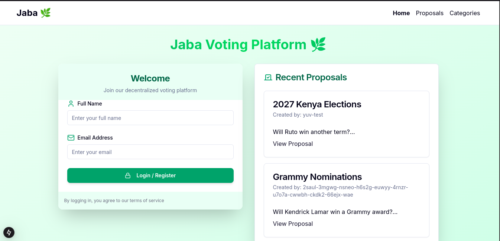
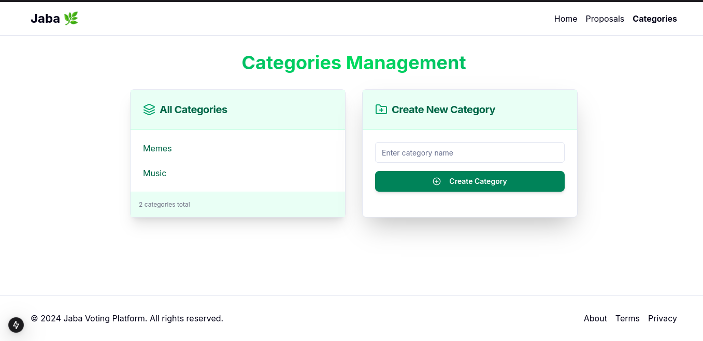
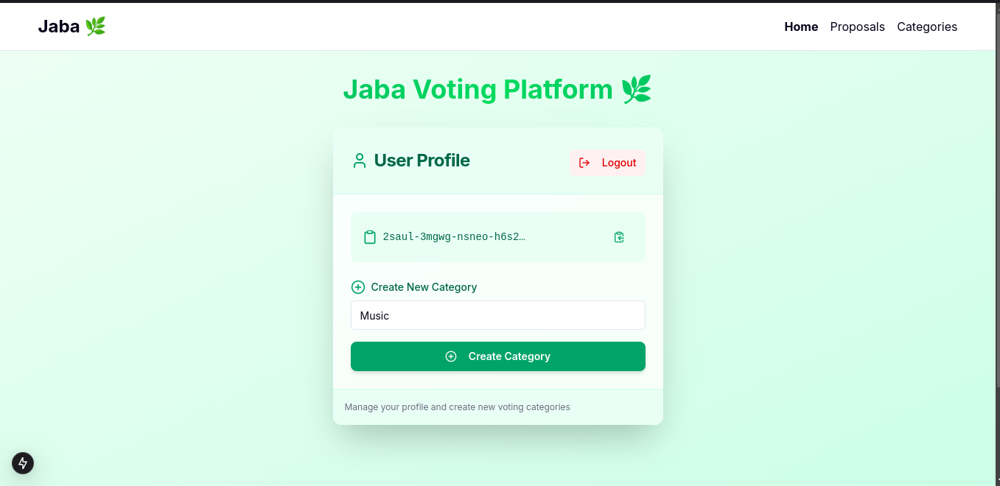
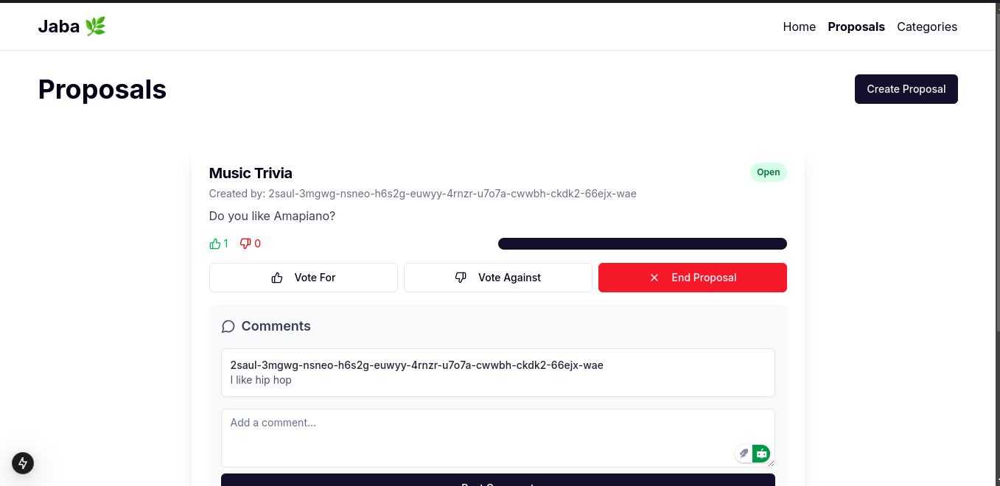

# Decentralized Voting Platform 🗳️🌐

## Overview 🚀

This is a full-stack decentralized voting platform built with cutting-edge web technologies, leveraging the Internet Computer Protocol (ICP) for secure and transparent voting mechanisms.

### Technology Stack 💻

- **Backend**: 
  - TypeScript
  - Azle (ICP Smart Contract Framework)
  - Internet Computer Protocol (ICP)

- **Frontend**:
  - Next.js
  - TypeScript
  - Comprehensive list of packages available in `package.json`

## Prerequisites 📋

Before you begin, ensure you have the following installed:
- Node.js (v18+ recommended) 🟢
- npm or yarn 📦
- dfx (Internet Computer SDK) 🛠️
- Git 🐙

## Project Structure 🗂️

```
voting-platform/
│
├── jaba_backend/     # Backend smart contract code
│   └── src/
│       └── ... 
│
└── jaba_frontend/    # Next.js frontend application
    └── src/
        └── ...
```

## Local Development Setup 🔧

### Backend Deployment 🖥️

1. Navigate to the backend directory:
   ```bash
   cd jaba_backend
   ```

2. Install dependencies:
   ```bash
   npm install
   ```

3. Start the local Internet Computer replica:
   ```bash
   dfx start --background
   ```

4. Deploy the smart contracts:
   ```bash
   dfx deploy
   ```

5. The backend will be deployed locally, and you can interact with the Candid UI to test API endpoints. 🎉

### Frontend Setup 🌈

1. Navigate to the frontend directory:
   ```bash
   cd jaba_frontend
   ```

2. Install dependencies:
   ```bash
   npm install
   ```

3. Start the development server:
   ```bash
   npm run dev
   ```

4. Open `http://localhost:3000` in your browser to view the application. 🚀

Make sure your .env looks like this, with your canister id

```
NEXT_PUBLIC_VOTING_CANISTER_ID=be2us-64aaa-aaaaa-qaabq-cai
NODE_ENV=development
NEXT_PUBLIC_IC_HOST=http://localhost:4943
```

The landing page will look similar to this



Category Management



User Profile



Proposals 



## API Endpoints 🔌

### User Management 👥
- `addOrUpdateUser(principal: string, name: string, email: string)`: 
  - Register or update a user's information ✏️
  - Returns the user object or an error

- `listUsers()`: 
  - Retrieve all registered users 📋

### Proposal Management 📝
- `createProposal(title: string, description: string, category: string, creator: string)`: 
  - Create a new proposal 🆕
  - Requires a registered user
  - Returns the created proposal or an error

- `getProposals()`: 
  - Retrieve all proposals 📑

- `getProposal(id: string)`: 
  - Retrieve a specific proposal by its ID 🔍

- `vote(proposalId: string, voteType: string, voter: string)`: 
  - Cast a vote on an open proposal 🗳️
  - Supports 'yes' or 'no' votes
  - Requires a registered user
  - Returns the updated proposal or an error

- `endProposal(proposalId: string)`: 
  - Close a proposal and finalize voting 🏁
  - Returns a success message or an error

### Comment System 💬
- `createComment(proposalId: string, content: string, author: string)`: 
  - Add a comment to a specific proposal 💭
  - Requires a registered user
  - Returns the created comment or an error

- `getComments(proposalId: string)`: 
  - Retrieve all comments for a specific proposal 📬

### Category Management 🏷️
- `createCategory(name: string)`: 
  - Create a new proposal category 🆕
  - Prevents duplicate categories
  - Returns the created category or an error

- `getCategories()`: 
  - Retrieve all proposal categories 📋

- `getCategory(id: string)`: 
  - Retrieve a specific category by its ID 🔎

### Utility Endpoints 🛠️
- `proposalsLen()`: Returns the total number of proposals 🔢
- `categoriesLen()`: Returns the total number of categories 🏷️
- `usersLen()`: Returns the total number of registered users 👤

## Features ✨

- Decentralized voting mechanism 🌐
- Secure proposal creation and interaction 🔒
- User authentication 🛡️
- Real-time proposal tracking 📊
- Categorized proposals 🏷️
- Commenting system 💬

## Contributing 🤝

1. Fork the repository 🍴
2. Create your feature branch (`git checkout -b feature/AmazingFeature`) 🌿
3. Commit your changes (`git commit -m 'Add some AmazingFeature'`) 💾
4. Push to the branch (`git push origin feature/AmazingFeature`) 🚀
5. Open a Pull Request 📬

## License 📜

[MIT License](LICENSE) ⚖️

## Contact 📞

- Contact Email: keithkadima@gmail.com 📧

## Acknowledgements 🙏

- Azle Framework 🛠️
- Internet Computer Protocol 🌐
- TypeScript 💻
- Next.js 🚀